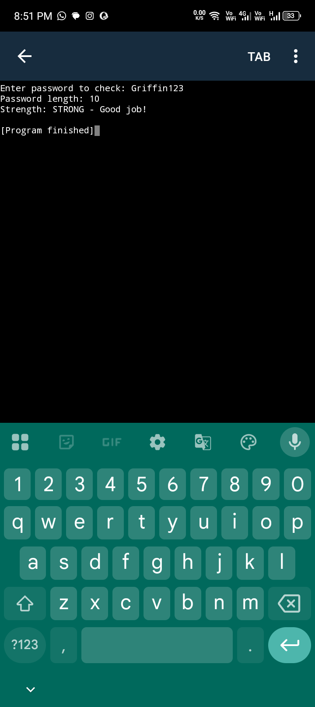

🔐 Password Strength Checker

My first Cybersecurity project as an Applied Computer Science student @ Chuka University.

What it does
Python tool that checks if password is WEAK / MEDIUM / STRONG.

How to run
1. Install Pydroid 3
2. Run Checker.py

Proof it works

Author: Griffin-cys

